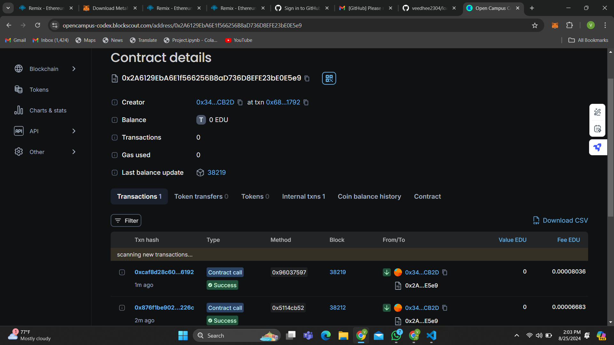

# StudentLoan Smart Contract

## Vision

The `StudentLoan` smart contract aims to revolutionize the student loan industry by leveraging blockchain technology. Our vision is to create a transparent, efficient, and automated system for issuing and managing student loans. By utilizing smart contracts, we provide a secure and immutable platform for handling loans, ensuring fair terms and simplifying the process for both borrowers and lenders.

## Project Features

- **Loan Issuance**: Issue loans to borrowers with specified amounts, interest rates, and durations.
- **Loan Repayment**: Allow borrowers to make payments towards their loans and track repayment status.
- **Interest Calculation**: Automatically calculate outstanding balances with interest over time.
- **Loan Term Updates**: Update loan terms, including interest rates and durations, for active loans.
- **Loan Extension**: Extend the duration of an active loan.
- **Funds Withdrawal**: Withdraw funds from the contract if the loan has been issued and not withdrawn yet.
- **Event Logging**: Emit events for critical actions such as loan issuance, payments, term updates, and fund withdrawals.

## Future Scope

- **Integration with Token Standards**: Integrate with ERC20 or ERC721 tokens to facilitate loan repayments using tokens or to represent ownership.
- **Decentralized Finance (DeFi) Integration**: Explore integration with DeFi protocols to offer additional financial services and features.
- **Automated Loan Collection**: Implement automated systems for collecting payments and managing overdue loans.
- **Enhanced Security Features**: Add additional security measures and audits to ensure the safety and integrity of the contract.
- **Frontend Interface**: Develop a user-friendly web interface for interacting with the contract.

## Project Structure

- **`contracts/StudentLoan.sol`**: Contains the smart contract code for managing student loans.
- **`scripts/deploy.js`**: Deployment script to deploy the smart contract to an Ethereum network.
- **`test/StudentLoan.test.js`**: Test suite to ensure the functionality of the smart contract.
- **`README.md`**: Documentation for the project.
- **`package.json`**: Project dependencies and configuration.

## Developer Details

- **Name**: Veedhee channey
- **Contact**: Veedheechanney2304@gmail.com
- **Contact address**: 0x2a6129eba6e1f566256b8ad736d8efe23be0e5e9

Feel free to reach out if you have any questions or contributions to the project!

## License

This project is licensed under the MIT License - see the [LICENSE](LICENSE) file for details.
